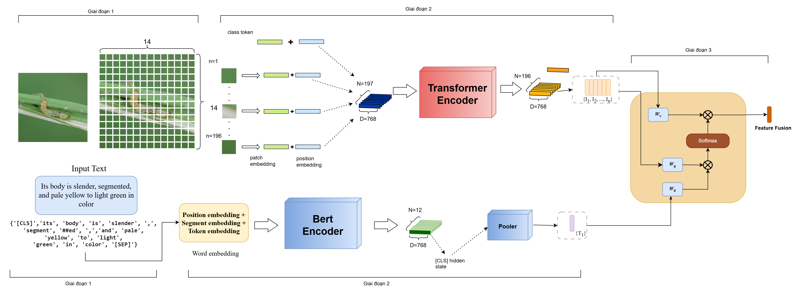

# 🐛 Multimodal Insect Recognition System

A multimodal deep learning system for insect species classification by combining visual and textual information.
The proposed approach integrates Vision Transformer (ViT), BERT, and Patch-wise Cross Attention for image-text feature fusion.

## Demo

The system allows users to upload insect images and receive species prediction with detailed information.

## Overview

Traditional insect classification methods mainly rely on visual features.
However, insect species often have similar appearances, making classification challenging.

This project explores a multimodal approach by combining:

- Image features from Vision Transformer (ViT)
- Text semantic features from BERT
- Cross-modal interaction using Patch-wise Cross Attention

The system aims to improve insect recognition by leveraging complementary information from images and descriptions.

## Architecture

The proposed architecture consists of three main components:

1. Visual Encoder
   - Vision Transformer (ViT)
   - Extracts image patch representations

2. Text Encoder
   - BERT
   - Generates semantic text embeddings

3. Multimodal Fusion
   - Patch-wise Cross Attention
   - Learns interaction between image patches and text features
  

## Dataset

The model was trained using insect image data based on IP102 dataset.

Additional textual descriptions were collected/generated from:

- Wikipedia
- GBIF metadata
- Image captioning model

Dataset statistics:

| Item | Value |
|---|---|
| Species | 102 |
| Images | ~14k |
| Modalities | Image + Text |

Dataset link: 
+ Caption Llava: https://drive.google.com/file/d/1vaGhS3sxq6hlbFoiyTszXtzut4ye9LG1/view?usp=drive_link
+ Caption Florence: https://drive.google.com/drive/folders/1vIJBN2k60fq3bio47fXFlsUIGLo0FASe?usp=drive_link
+ Image: https://drive.google.com/file/d/1C5u95rQAJ9PgIzVTjYFG4ZdIZ-nMRC6h/view?usp=drive_link
+ Label: https://drive.google.com/file/d/1rk0fl_CkouzrYGjDV1wD46JeVLIUM4xQ/view?usp=drive_link

